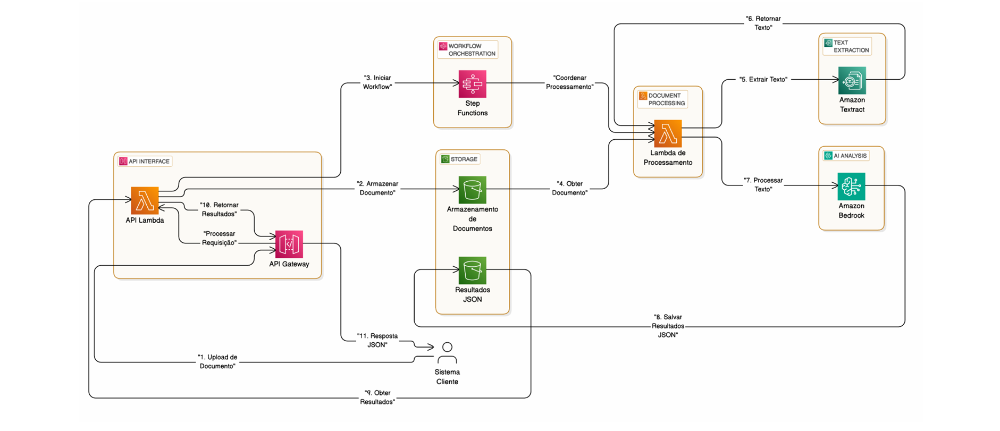

# Extração de Dados Judiciais com IA para SEI-Informática

## Resumo Executivo

Propomos uma **Prova de Conceito (PoC)** focada na extração de **dados financeiros de sentenças judiciais brasileiras**, utilizando **modelos fundacionais AWS Bedrock**.

### Objetivos:
- Validar a **viabilidade técnica** com uma fase de pré-validação
- Processar documentos **de até 300MB em até 5 minutos**
- Fornecer uma **API** para integração com os sistemas da SEI-Informática

## Hipóteses Principais a Validar

1. **Precisão da Extração**  
   Os modelos fundacionais conseguem extrair com precisão dados financeiros de sentenças judiciais em português brasileiro?

2. **Desempenho de Processamento**  
   A solução consegue processar documentos de 300MB dentro de 5 minutos?

3. **Linguagem Jurídica Brasileira**  
   O sistema consegue lidar com terminologia jurídica especializada?

4. **Viabilidade de Integração**  
   Os dados extraídos podem ser entregues em **JSON compatível**?

5. **Melhoria do Fluxo de Trabalho**  
   A automação reduz significativamente o tempo de análise?

